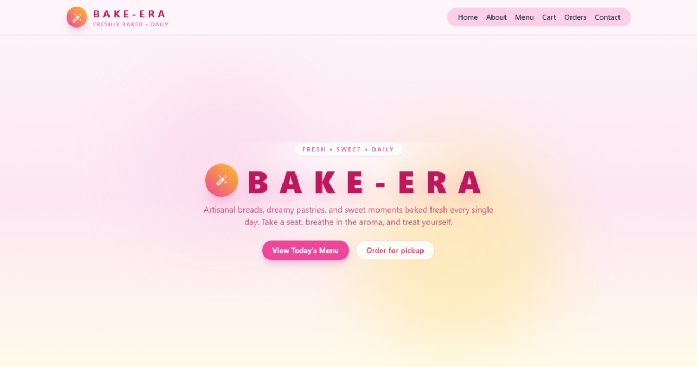
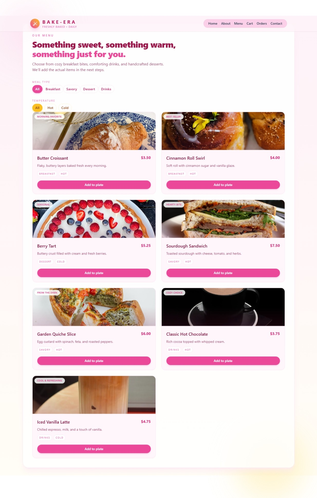
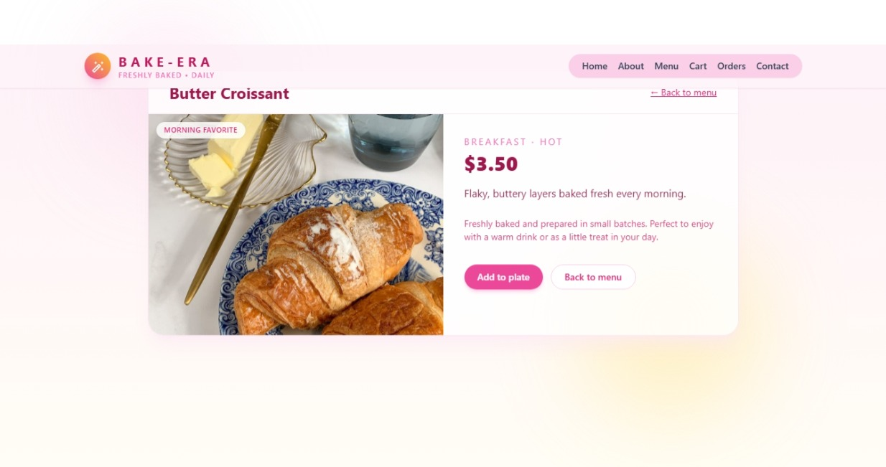
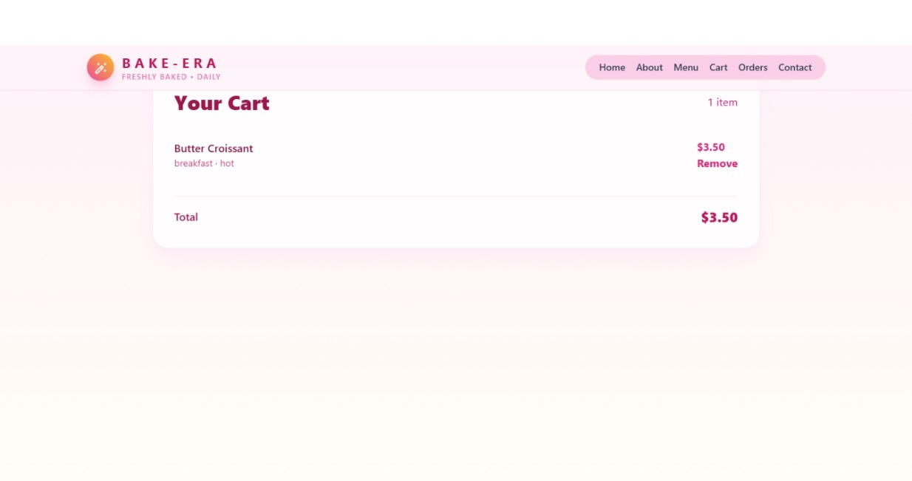

# BAKE-ERA 🍞🥐

A beautiful, responsive bakery web app built with React. Users can browse the menu, view details of dishes, add items to their cart, and contact the bakery. The app emphasizes smooth UI, cozy animations, and a modern, warm design.

---

## Table of Contents
- [Overview](#overview)
- [Features](#features)
- [Demo](#demo)
- [Installation](#installation)
- [Usage](#usage)
- [Folder Structure](#folder-structure)
- [Technologies Used](#technologies-used)
- [Contributing](#contributing)
- [License](#license)

---

## Overview
BAKE-ERA is a front-end React project simulating a bakery experience online. Users can:
- View the homepage with animated branding and background elements
- Explore the About page with the bakery's story
- Browse the menu, filter items by meal type and temperature, and view detailed dish pages
- Add items to the cart and see the total price update in real-time
- Submit messages via a contact form
- Explore orders (placeholder page)

---

## Features
- Fully responsive design using Tailwind CSS
- Dynamic routing with React Router
- State management via `useState` for cart and form interactions
- Smooth transitions and hover animations on UI elements
- Menu filtering by meal type (breakfast, savory, dessert, drinks) and temperature (hot/cold)
- Detailed dish pages with add-to-cart functionality
- Contact form with success notification animation

---
## Screenshots

### Homepage


### Menu Page


### Dish Detail


### Cart Page


### Contact Page


## Demo

Here are some animated GIFs showing the app in action (replace these with your actual GIFs):

**Homepage Animations**


**Menu Page with Filters**


**Dish Detail & Add to Cart**


**Cart Page Overview**


**Contact Form Submission (Optional)**


> Tip: Record these using LICEcap, ShareX, or ScreenToGif. Optimize GIFs for small file size to avoid slowing down the README.

---

## Installation
1. Clone the repository:
```bash
git clone https://github.com/safsuf123/restaurant-system.git

2-Navigate to the project folder: 

cd restaurant-system
Install dependencies:

npm install

Start the development server:

npm start

Open http://localhost:3000Attachment.png in your browser.


Usage
Navigate the site using the top navbar.

Click on Menu to browse items.

Click an item to see details and add to the cart.

Check your cart at any time using the Cart page.

Submit messages via the Contact page.


Folder Structure
/src
/components
Main.jsx
Navbar.jsx
Tryout.jsx
/pages
About.jsx
Home.jsx
Menu.jsx
Cart.jsx
Dishdetail.jsx
Orders.jsx
Contact.jsx
App.jsx
index.js 


Technologies Used
React

React Router DOM

Tailwind CSS

Material UI Icons


Contributing


Contributions are welcome! Please fork the repo and create a pull request.


License


This project is open-source under the MIT License.


